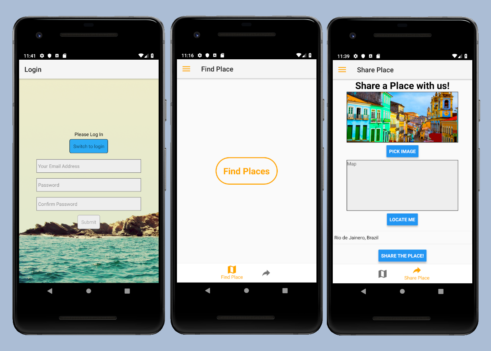

# React Native Project 03

This is an android application I build using React Native. 

# The App looks like this;

# Basic set up and installation

* [Getting Started](https://facebook.github.io/react-native/docs/getting-started)

# Libraries used

* [React Native](https://facebook.github.io/react-native/)
* [React Native Navigation](https://wix.github.io/react-native-navigation/#/)
* [React Native Dimensions](https://facebook.github.io/react-native/docs/height-and-width.html)
* [Flexbox in React Native](https://facebook.github.io/react-native/docs/flexbox.html)
* [React Native Animations](https://facebook.github.io/react-native/docs/animations.html)
* [Styling React Native](https://github.com/vhpoet/react-native-styling-cheat-sheet)

# What I Learned

* Setup android SDK in local enviroment and interact with simulators.
* Create a good development setup for React Native.
* Create a basic React Native app.
* How React Native works and runs.
* How to build a reusable React Native components.
* Interact with the user using TextInputs and Validations.
* Create a dynamic UI by allowing user to upload images to the server. 

